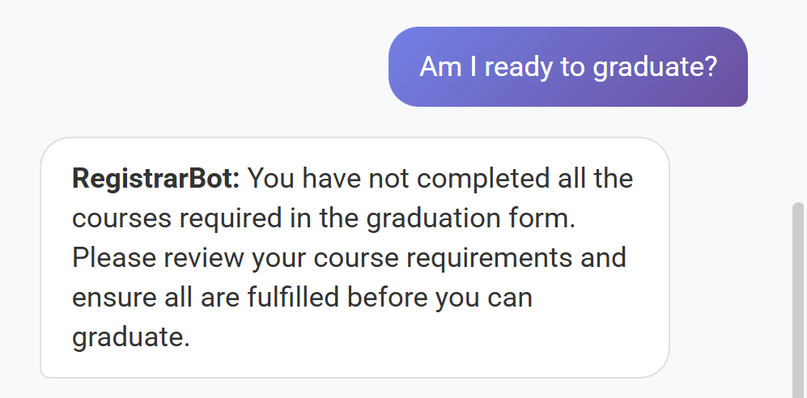
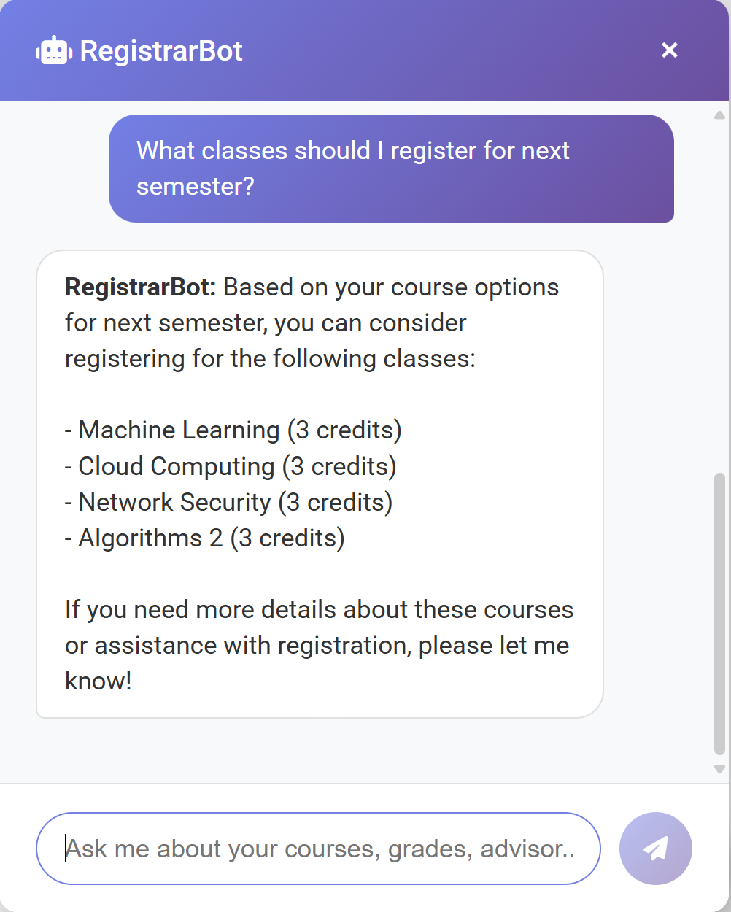
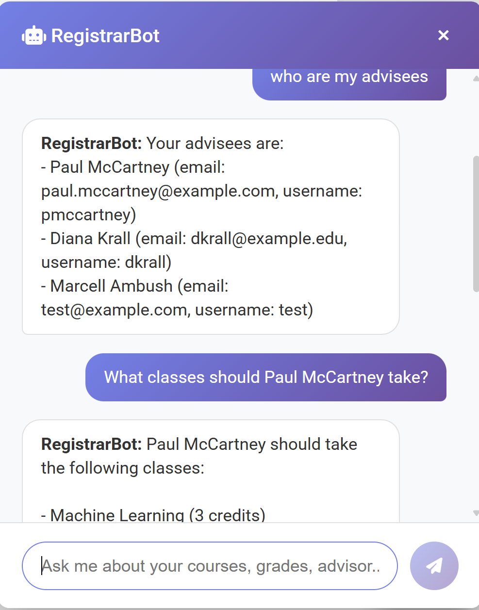
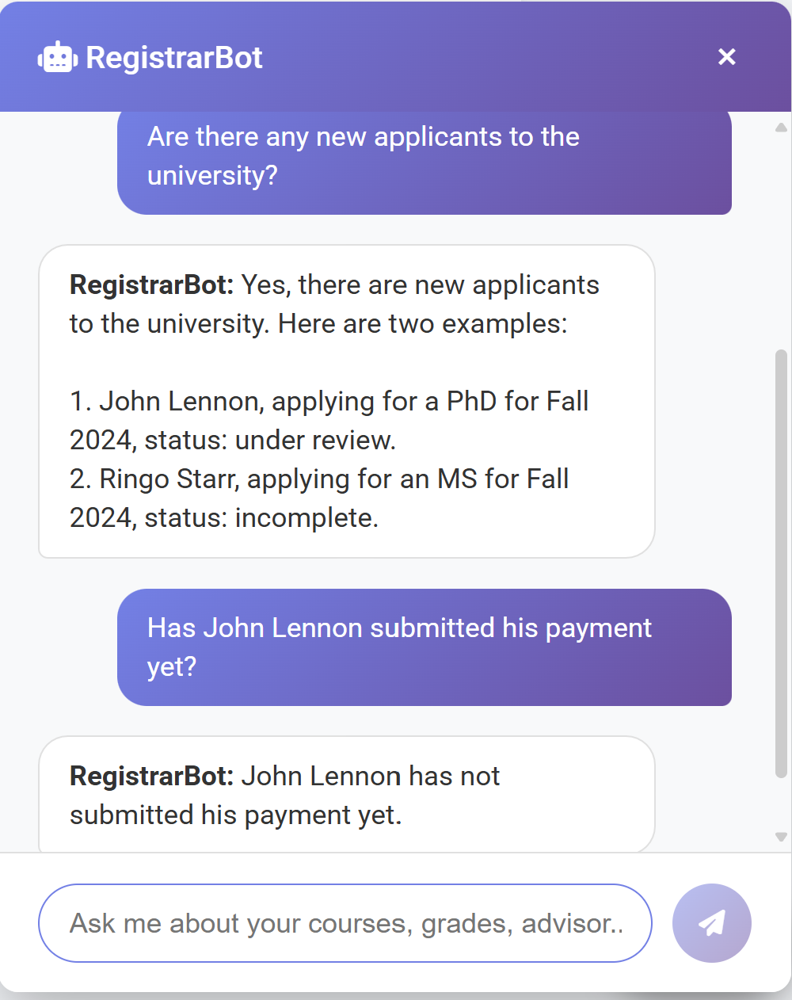

## My Program
**University_Registrar_System** is a full-stack academic management system simulating a university registrar. Enabling end-to-end functionality including applicant acceptance, course registration, grade assignment, and graduation processing. A dynamic chatbot is ready for assistance to answer any university related questions users may have.

## Features:
- **AI Chatbot**: Context and role aware assistant retaining conversation history for personalized support.
- **Secure Authentication**: Session-based login and role validation.
- **Role-Based Workflows**: Distinct permissions and interfaces for Applicants, Students, Alumni, Faculty, Graduate Secretaries, and Administrators.
- **Course Lifecycle Management**: Admissions → Enrollment → Grading → Graduation.
- **Billing & Payments**: Tuition payment requirements prior to enrollment.
- **Database Reset Tool**: Quickly initialize database state from login page.

## Technologies Used
 - **Backend**: Python (Flask), SQLite
 - **Frontend**: HTML, CSS, JavaScript
 - **Database**: SQL (SQLite)
 - **Chatbot**: Azure OpenAI

## How to run the program

1. **Simply clone the repository:**
   
   - git clone https://github.com/dandob1/Registrar_Project_with_Chatbot.git

   - cd Registrar_Project_with_Chatbot
2. **Required installations (not necessarily exhaustive):**
   
    - pip install Flask openai
3. **Compile and run the project:**

    Use the following command:
   
        python main.py
4. **On first launch click RESET DATABASE on login page**

## How to use the chatbot
  - Simply sign in as any user and click the pop up button in the bottom right corner of the screen.
  - Speak to your new AI agent.
      - If signed in as a student try asking: "Am I ready to graduate?" or "What classes are offered?" or "What classes should I take?"
      - If signed in as an advisor try asking: "Who are my advisees?" " or "What classes do I teach this semester?" or "What classes should (advisee full name here) take?
      - If signed in as a admin try asking: "Are there any applicants to the university?" or "Has (applicant name here) submitted his payment?"
      - etc.
      - Help: if the bot does not answer a question on the first pass try rephrasing the question or prompting it again.
 ## Chatbot Demo
 
 For Students:
 
  
 
        
 For Faculty:
 
 
 
 For Admins:
 
  

## How to use the program for full application to graduation
  - Create a new user with the apply to university feature.
  - Once the account is created login with user "11111111" and password "pass" as a faculty advisor.
  - Navigate to the view applications button.
  - View the user you just applied as and approve them to the university by filling out all necessary fields
  - Log back in to the user you created with the UID provided and password you created.
  - Follow instructions on the submit payment button.
  - Login as user "33445566" and password "pass" as a grad secretary
  - Navigate to view applications and matriculate the student you created. Also assign them an advisor from the homepage table's "assign advisor" button.
  - Login as the user you created and submit their advising form for classes they plan to take. Make sure to adhere to all prerequisites and required courses.
  - Approve the advising form from the users faculty advisor page
  - Register for the classes selected in the form from the student homepage
  - Sign in as the grad secretary and provide grades for all of the courses selected. Make sure the GPA is above 3.0 for MS students and above 3.5 for PhD students.
  - If user is a PhD student submit their thesis and approve it just as done with the form.
  - Once all courses have been taken, form/thesis is approved, you can request graduation from the student homepage.
  - Process the graduation from the grad secretary
  - If all requirements have been met and student has successfully graduated, you can sign into their account using the same login and see their admin page
